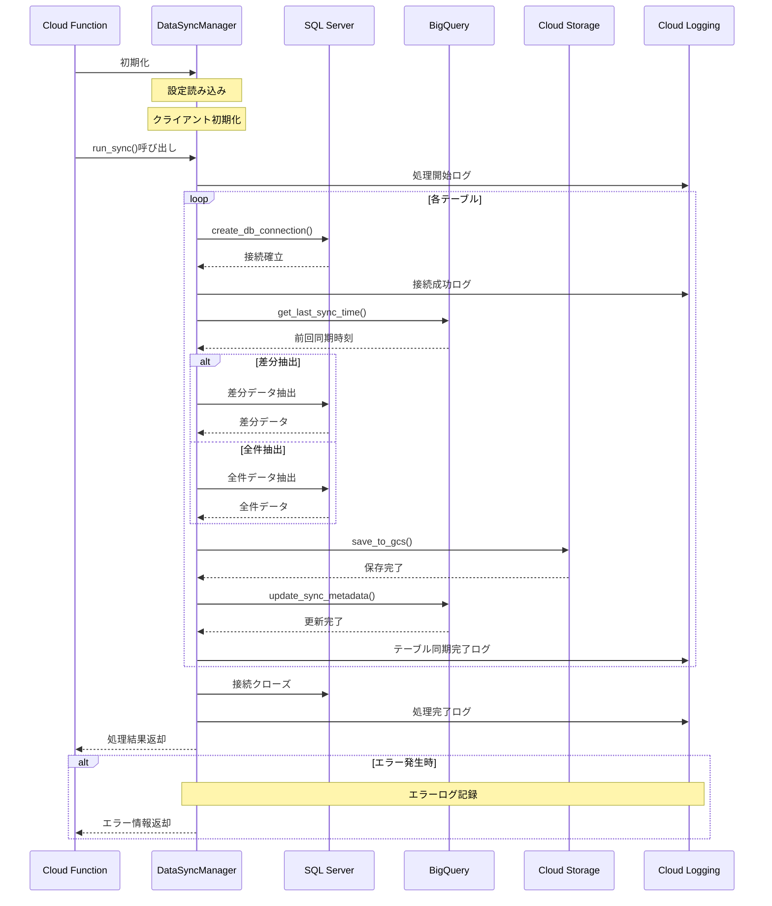

# シーケンス図

```mermaid
sequenceDiagram
    participant CF as Cloud Function
    participant DSM as DataSyncManager
    participant DB as SQL Server
    participant BQ as BigQuery
    participant GCS as Cloud Storage
    participant CL as Cloud Logging

    CF->>DSM: 初期化
    Note over DSM: 設定読み込み
    Note over DSM: クライアント初期化

    CF->>DSM: run_sync()呼び出し
    DSM->>CL: 処理開始ログ

    loop 各テーブル
        DSM->>DB: create_db_connection()
        DB-->>DSM: 接続確立
        DSM->>CL: 接続成功ログ

        DSM->>BQ: get_last_sync_time()
        BQ-->>DSM: 前回同期時刻

        alt 差分抽出
            DSM->>DB: 差分データ抽出
            DB-->>DSM: 差分データ
        else 全件抽出
            DSM->>DB: 全件データ抽出
            DB-->>DSM: 全件データ
        end

        DSM->>GCS: save_to_gcs()
        GCS-->>DSM: 保存完了

        DSM->>BQ: update_sync_metadata()
        BQ-->>DSM: 更新完了

        DSM->>CL: テーブル同期完了ログ
    end

    DSM->>DB: 接続クローズ
    DSM->>CL: 処理完了ログ
    DSM-->>CF: 処理結果返却

    alt エラー発生時
        Note over DSM,CL: エラーログ記録
        DSM-->>CF: エラー情報返却
    end
```