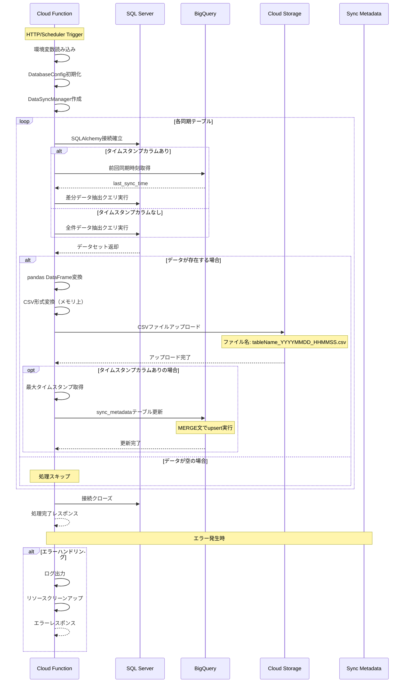

# sequence

```mermaid
sequenceDiagram
    participant CF as Cloud Function
    participant SS as SQL Server
    participant BQ as BigQuery
    participant GCS as Cloud Storage
    participant SM as Sync Metadata

    Note over CF: HTTP/Scheduler Trigger

    CF->>CF: 環境変数読み込み
    CF->>CF: DatabaseConfig初期化
    CF->>CF: DataSyncManager作成

    loop 各同期テーブル
        CF->>SS: SQLAlchemy接続確立
        
        alt タイムスタンプカラムあり
            CF->>BQ: 前回同期時刻取得
            BQ-->>CF: last_sync_time
            CF->>SS: 差分データ抽出クエリ実行
        else タイムスタンプカラムなし
            CF->>SS: 全件データ抽出クエリ実行
        end

        SS-->>CF: データセット返却
        
        alt データが存在する場合
            CF->>CF: pandas DataFrame変換
            CF->>CF: CSV形式変換（メモリ上）
            CF->>GCS: CSVファイルアップロード
            Note over GCS: ファイル名: tableName_YYYYMMDD_HHMMSS.csv
            GCS-->>CF: アップロード完了

            opt タイムスタンプカラムありの場合
                CF->>CF: 最大タイムスタンプ取得
                CF->>BQ: sync_metadataテーブル更新
                Note over BQ: MERGE文でupsert実行
                BQ-->>CF: 更新完了
            end
        else データが空の場合
            Note over CF: 処理スキップ
        end
    end

    CF->>SS: 接続クローズ
    CF-->>CF: 処理完了レスポンス

    Note over CF,SM: エラー発生時
    alt エラーハンドリング
        CF->>CF: ログ出力
        CF->>CF: リソースクリーンアップ
        CF-->>CF: エラーレスポンス
    end
```
